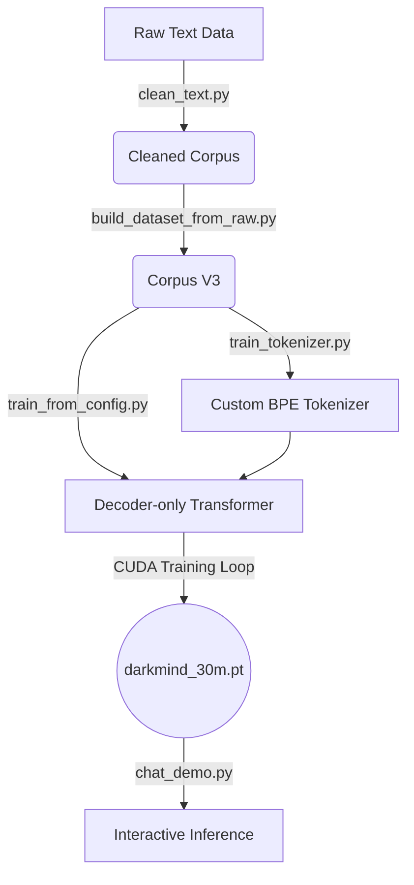

# DarkMind-30M 🧠

[](https://colab.research.google.com/github/petrofi/darkmind-30m/blob/main/notebooks/Quick_Start.ipynb)


> **A small-scale, decoder-only Large Language Model (LLM) built entirely from scratch in PyTorch.**

DarkMind-30M is a project aimed at demystifying the architecture behind modern LLMs (like GPT). Instead of fine-tuning an existing model, this repository contains a complete pipeline to build a mini-LLM from the ground up: from creating a custom Byte-Level BPE tokenizer to writing the Transformer architecture and executing a custom CUDA-accelerated training loop.

## 🌟 Key Features
- **From-Scratch Architecture:** A custom Tiny-GPT style decoder-only Transformer model.
- **Custom Tokenizer:** Includes scripts to train a Byte-Level BPE tokenizer on raw text data.
- **End-to-End Pipeline:** Scripts for data cleaning, corpus generation, tokenization, model training, and interactive inference.
- **CUDA Support:** Fully utilizes GPU acceleration for training (`PyTorch 2.11+cu128`).
- **Unit Tested:** Built-in validation to ensure tensor shapes and forward passes remain stable.

---

## 🏗️ Architecture & Pipeline



---

## 🚀 Quick Start

The fastest way to test the model architecture without setting up a local environment is via our Google Colab Notebook:

[](https://colab.research.google.com/github/petrofi/darkmind-30m/blob/main/notebooks/Quick_Start.ipynb)

### Local Installation

1. **Clone the repository:**
```bash
git clone https://github.com/petrofi/darkmind-30m.git
cd darkmind-30m
```

2. **Install requirements:**
```bash
pip install -r requirements.txt
```

3. **Run the interactive chat demo:**
*(Ensure you have a trained checkpoint at `checkpoints/darkmind_30m.pt`)*
```bash
python scripts/chat_demo.py --checkpoint checkpoints/darkmind_30m.pt --temperature 0.8
```

---

## 🛠️ Data Pipeline Details

### 1. Data Cleaning and Corpus Building
```powershell
python scripts/clean_text.py
python scripts/build_dataset_from_raw.py
python scripts/dataset_quality_check.py
```

### 2. Tokenizer Training
```powershell
python scripts/train_tokenizer.py --data_path data/processed/corpus_v3.txt
```

### 3. Model Training
```powershell
python scripts/train_tokenizer.py --data_path data/processed/splits/train.txt
```

---

## 🤖 Self-Improvement Pipeline

DarkMind uses a unique self-improvement loop that identifies weak answers, creates correction candidates, and awaits human approval before retraining.

```powershell
# Evaluate model
python scripts/eval_model.py --checkpoint checkpoints/darkmind_30m.pt

# Generate and review candidates
python scripts/generate_correction_candidates.py
python scripts/approve_candidates.py --input_path data/self_improvement/pending_review/correction_candidates.txt --approve_all
```

---

<details>
<summary>🇹🇷 Türkçe Dökümantasyon (Turkish Documentation)</summary>

DarkMind-30M, Türkçe odaklı küçük bir dil modeli geliştirme projesidir. 

Hazır bir modeli fine-tune etmek yerine sıfırdan bir mini decoder-only Transformer mimarisi kurmayı, kendi tokenizer'ını eğitmeyi ve kendi training loop'u ile model eğitmeyi amaçlar.

### Hedefler
- Türkçe odaklı mini LLM geliştirmek
- Kendi tokenizer'ını eğitmek
- Decoder-only Transformer mimarisini sıfırdan yazmak
- CUDA destekli eğitim pipeline'ı kurmak

### Mevcut Durum
- Byte-Level BPE tokenizer eğitildi
- Tiny GPT mimarisi yazıldı
- CUDA aktif edildi
- İlk checkpoint üretildi
- Eğitim pipeline'ı başarıyla çalıştırıldı
</details>

## 📄 License
This project is licensed under the MIT License. See the [LICENSE](LICENSE) file for details.
